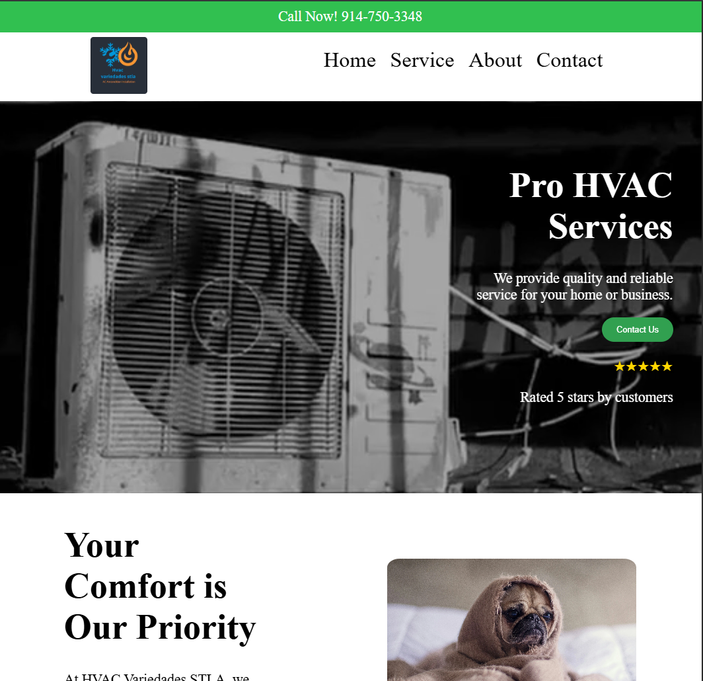

# HVAC Variedades STLA — Client Website
Developed a complete business website for a private client company. Features include a landing page, services page, and an interactive contact form with both simple and advanced modes, allowing users to specify their HVAC needs at their preferred level of detail. Form submissions route directly to the client's email via PHP.

Source code is kept private out of respect for client confidentiality. The live site can be viewed at: 
https://hvacvariedadesstla.com/

*Note: Site was designed and developed from scratch in approximately two weeks with no prior web development experience.*

Technologies: HTML, CSS, JavaScript, PHP
